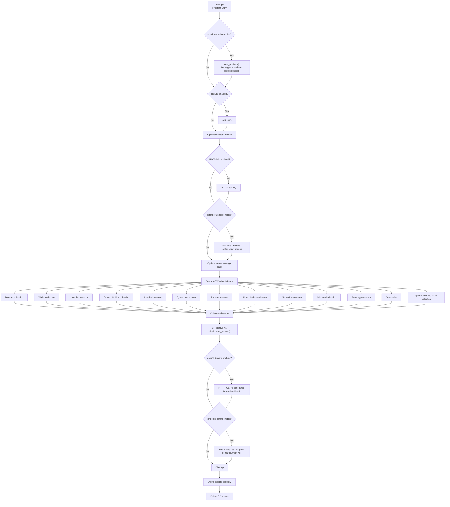

<div align="center">

<p align="center">
  
</p>

<h1 align="center">VicSteal — Technical Malware Analysis Report</h1>

<p align="center">
  Defensive reverse-engineering and incident-response documentation
  based on the supplied Python source code.
</p>

<br>

<p align="center">
  
  
  
  
  
</p>

</div>

<br>

<details>
  <summary>Table of Contents</summary>
  <ol>
    <li><a href="#1-executive-summary">Executive Summary</a></li>
    <li><a href="#2-analysis-scope">Analysis Scope</a></li>
    <li><a href="#3-workflow-diagram">Workflow Diagram</a></li>
    <li><a href="#4-high-level-architecture">High-Level Architecture</a></li>
    <li><a href="#5-detailed-execution-flow">Detailed Execution Flow</a></li>
    <li><a href="#6-collection-capabilities">Collection Capabilities</a></li>
    <li><a href="#7-exfiltration-and-cleanup">Exfiltration and Cleanup</a></li>
    <li><a href="#8-detection-and-monitoring">Detection and Monitoring</a></li>
    <li><a href="#9-mitre-attck-mapping">MITRE ATT&amp;CK Mapping</a></li>
    <li><a href="#10-evidence-mapping">Evidence Mapping</a></li>
    <li><a href="#11-forensic-artifacts">Forensic Artifacts</a></li>
    <li><a href="#12-what-is-not-observed">What Is Not Observed</a></li>
    <li><a href="#13-analyst-notes-and-limitations">Analyst Notes and Limitations</a></li>
    <li><a href="#14-recommended-defensive-controls">Recommended Defensive Controls</a></li>
    <li><a href="#15-analyst-summary">Analyst Summary</a></li>
    <li><a href="#16-source-references">Source References</a></li>
    <li><a href="#disclaimer">Disclaimer</a></li>
    <li><a href="#contributing">Contributing</a></li>
    <li><a href="#contributors">Contributors</a></li>
    <li><a href="#license">License</a></li>
  </ol>
</details>

---


## 1. Executive Summary

`VicSteal` is a Python-based Windows data-collection project whose supplied source implements a broad local information and credential collection workflow followed by archive staging and remote transmission.

The reviewed implementation contains the following major stages:

1. Optional anti-analysis checks for debuggers and known analysis tools.
2. Optional locale/CIS restriction.
3. Optional execution delay and UAC elevation request.
4. Optional Windows Defender configuration changes.
5. Creation of a staging directory under `C:\Windows\Temp`.
6. Collection of browser data, wallet data, application files, game data, system information, browser versions, tokens, network information, clipboard contents, running processes, and screenshots.
7. Application-specific file collection driven by `vic_config.py`.
8. Compression of the collected directory into a ZIP archive.
9. Transmission of the archive through Discord and/or Telegram when configured.
10. Deletion of the local staging directory and ZIP archive after the transmission stage.

The default configuration supplied in `vic_config.py` enables most collection modules, anti-analysis, Defender modification, and both Discord and Telegram transmission. The embedded Telegram token, chat identifier, and Discord webhook are intentionally not reproduced in this report.

The most significant observable behavior is therefore a **collection → staging → archive → web-service transmission → cleanup** chain.

---

## 2. Analysis Scope

### Source files reviewed

| File / Directory | Role |
|---|---|
| `main.py` | Main orchestration and execution flow |
| `vic_config.py` | Collection and transmission configuration |
| `modules/antianalysis/check_analysis.py` | Debugger and analysis-process checks |
| `modules/antiVM/antiVM.py` | Anti-VM implementation present in source |
| `modules/antivirus/antivirus.py` | Windows Defender configuration changes |
| `modules/CIS/anti_cis.py` | Locale/CIS-related execution check |
| `modules/runasadmin/run_as_admin.py` | UAC/elevation request |
| `modules/Browsers/*` | Browser discovery and browser-data collection |
| `modules/tokens/*` | Discord token collection |
| `modules/wallet/*` | Cryptocurrency-wallet collection |
| `modules/software_files/*` | Application-specific and game-related collection |
| `modules/client_files/*` | Local file collection |
| `modules/system/*` | System information collection |
| `modules/network/*` | Network reconnaissance/collection |
| `modules/clipper_data/*` | Clipboard collection |
| `modules/screan_shot/*` | Screenshot capture |
| `modules/Process/*` | Running-process collection |
| `modules/installed_software/*` | Installed-software enumeration |
| `modules/send/*` | Telegram and Discord transmission |
| `log_Style.py` | Transmission message formatting |
| `main.spec`, `build.bat` | PyInstaller/build configuration |

The analysis is based on the supplied source tree. Compiled `__pycache__` artifacts were treated as secondary artifacts rather than as the primary source of behavioral conclusions.

---

## 3. Workflow Diagram

The following Mermaid diagram represents the observed high-level execution path.



---


## 3.1 Visual Analysis Materials

The following visuals are included as supporting defensive-analysis material. They summarize behavior already documented in this report and do not introduce additional capabilities.

### High-Level Execution Flow


### Collection Architecture


### Defensive Detection Chain


### Behavioral Flow Video

> **Defensive overview:** the video is a high-level visualization of the execution sequence. It intentionally avoids reproducing operational credential-theft or evasion instructions.

[Open the behavioral-flow.mp4 video](README_assets/behavioral-flow.mp4)


## 4. High-Level Architecture

The source can be divided into five logical layers.

### Component A --- Execution control

`main.py` controls:

- configuration evaluation,
- anti-analysis invocation,
- CIS/locale checking,
- execution delay,
- elevation request,
- Defender configuration changes,
- collection scheduling,
- archive creation,
- transmission,
- cleanup.

### Component B --- Collection modules

The collection layer contains separate modules for:

- browsers,
- wallets,
- application files,
- games,
- Roblox data,
- Discord tokens,
- system information,
- network information,
- clipboard contents,
- screenshots,
- running processes,
- installed software.

### Component C --- Application collector

`vic_config.py` supplies a list of application names, directories, and file patterns. `StealAll` uses this configuration to copy matching application data into the staging directory.

### Component D --- Staging and transmission

Collected data is placed under a temporary directory, compressed into a ZIP archive, and sent through HTTP POST requests to configured web services.

### Component E --- Build / packaging

`main.spec` and `build.bat` indicate a PyInstaller-based Windows executable build workflow, including one-file packaging and an icon resource.

---

# 5. Detailed Execution Flow

## 5.1 Program entry and configuration

`main.py` imports the collection and support modules and loads the `config` dictionary from `vic_config.py`.

The `main()` function is the primary execution entry point and is called from the module's `__main__` block.

The supplied configuration enables:

- `checkAnalysis`
- `antiCIS`
- browser extraction
- wallet extraction
- game extraction
- local file extraction
- system-information extraction
- browser-version extraction
- token extraction
- network collection
- clipboard collection
- Defender modification
- process extraction
- screenshot capture
- application collector
- Discord transmission
- Telegram transmission

**Evidence:** `main.py`, lines 36--135; `vic_config.py`, lines 2--26.

---

## 5.2 Anti-analysis stage

When `checkAnalysis` is enabled, `main.py` instantiates `Anti_Analysis`.

The class performs two principal checks.

### Debugger detection

`check_analysis.py` uses Windows APIs including:

```text
IsDebuggerPresent
CheckRemoteDebuggerPresent
NtQueryInformationProcess
```

If a debugger is detected, the code calls:

```text
ExitProcess(0)
```

### Analysis-tool process detection

The code enumerates Windows processes through WMI and compares process names against a blacklist containing analysis and monitoring tools such as debuggers, reverse-engineering tools, packet analyzers, and system-monitoring utilities.

If a matching process is found, the code terminates the current process.

**Evidence:** `modules/antianalysis/check_analysis.py`, lines 11--68.

### Security significance

Observed chain:

```text
Process enumeration
       ↓
Known analysis-tool comparison
       ↓
Match detected
       ↓
ExitProcess(0)
```

This is an explicit anti-analysis behavior.

---

## 5.3 CIS / locale check

When `antiCIS` is enabled, `main.py` invokes `anti_cis()`.

The exact effect of this check should be interpreted from `modules/CIS/anti_cis.py`; the supplied source contains a dedicated CIS/locale control that can affect whether subsequent execution continues.

**Evidence:** `main.py`, lines 41--42; `modules/CIS/anti_cis.py`.

---

## 5.4 Optional execution delay

`main.py` checks `executionDelay` and, when non-empty, calls `time.sleep()` with the configured value.

In the supplied default configuration the value is an empty string, so no default delay is requested.

**Evidence:** `main.py`, lines 44--45; `vic_config.py`, line 10.

---

## 5.5 Optional UAC elevation

When `UACAdmin` is enabled, `main.py` invokes `run_as_admin()`.

The helper uses the Windows `runas` mechanism to request elevated execution.

In the supplied configuration:

```text
UACAdmin = False
```

Therefore the elevation branch is present but disabled by default.

**Evidence:** `main.py`, lines 47--48; `vic_config.py`, line 4; `modules/runasadmin/run_as_admin.py`.

---

## 5.6 Windows Defender configuration change

When `defenderDisable` is enabled, `main.py` invokes `deseble_defander()`.

The helper launches PowerShell and calls `Add-MpPreference` with parameters related to:

- an exclusion path for the running executable, and
- Controlled Folder Access allowed applications.

The PowerShell process is configured to run without a visible window.

The supplied configuration sets:

```text
"defenderDisable": True
```

**Evidence:** `modules/antivirus/antivirus.py`, lines 7--25; `main.py`, lines 51--52; `vic_config.py`, line 21.

### Security significance

This is an observable modification of Windows security-product configuration and should be treated as a high-value detection point.

---

## 5.7 Optional error-message dialog

If `errorMessage` is non-empty, `main.py` displays a message box with the title:

```text
System Error
```

The supplied configuration contains a generic error-style message.

**Evidence:** `main.py`, lines 54--55; `vic_config.py`, line 25.

This can provide a benign-looking user-facing presentation while the collection workflow continues.

---

# 6. Staging Directory

The main function creates a collection directory under:

```text
C:\Windows\Temp\<configured-log-file-name>
```

The directory is created before the collection modules execute.

**Evidence:** `main.py`, lines 57--62.

The collected artifacts from the enabled modules are written below this directory.

---

# 7. Browser Data Collection

When `extractBrowsersData` is enabled, `main.py` invokes:

```text
Walkthrough(result_log_dir)
```

The browser workflow includes browser discovery and profile processing and calls collection routines for:

- stored login data,
- cookies,
- credit-card data,
- browsing history,
- downloads,
- autofill data.

The browser implementation also contains browser-process termination logic for a list of Chromium-family and related browser processes.

The browser cryptographic helper contains Windows protected-key handling and AES/ChaCha20-related processing. The source includes code for Windows credential-key access, including an `lsass.exe` token impersonation path and `SeDebugPrivilege` handling for an app-bound key path.

**Evidence:** `modules/Browsers/Browser.py`; `modules/Browsers/get_masterkey.py`.

### Defensive significance

A process that combines browser-profile database access, Windows protected-key APIs, cryptographic processing, and credential/cookie output is a strong behavioral investigation signal.

---

# 8. Wallet Collection

When `extractWallets` is enabled, `main.py` invokes:

```text
Wallets(result_log_dir)
```

The project contains a dedicated `modules/wallet/wallet.py` module for wallet-related data collection.

**Evidence:** `main.py`, lines 68--69; `modules/wallet/wallet.py`.

The report intentionally does not reproduce wallet-specific extraction instructions or secret-handling details.

---

# 9. Local File Collection

When `extractFiles` is enabled, the project invokes:

```text
steal_desktop_txt_file(result_log_dir)
```

This module is dedicated to collecting local user files matching its implemented criteria.

**Evidence:** `main.py`, lines 71--72; `modules/client_files/client_files.py`.

---

# 10. Game and Roblox Data

When `extractGameData` is enabled, the project invokes:

```text
gamesSteal(result_log_dir)
extract_roblox_cookies(result_log_dir)
```

The Roblox module accesses a local Roblox cookie database/file and uses Windows protected-data processing on the stored material.

**Evidence:** `main.py`, lines 74--76; `modules/software_files/games/games.py`; `modules/software_files/roblox/roblox_.py`.

---

# 11. Installed Software Enumeration

`main.py` calls the installed-software module regardless of the `extractSystemInfo` switch:

```text
installed_software.get_installed_programs(result_log_dir)
```

This provides an inventory of installed programs that can be used for host profiling.

**Evidence:** `main.py`, line 78; `modules/installed_software/instaled_Software.py`.

---

# 12. System Information Collection

When `extractSystemInfo` is enabled, `getOS()` collects host information including observable values such as:

- executable path,
- hostname,
- username,
- hardware UUID information,
- Windows UI language,
- system uptime,
- public IP/geolocation information through an external IP information service,
- additional Windows/system information implemented in the module.

The source explicitly makes an HTTP request to an external IP information service.

**Evidence:** `modules/system/systemInfo.py`, lines 30--80.

### Defensive significance

This network request is distinct from the later archive-exfiltration stage: it is a host-identification request made during system-information collection.

---

# 13. Browser-Version Enumeration

When `extractBrowsersVersion` is enabled, the project calls:

```text
all_browsers_version(result_log_dir)
```

This module enumerates browser versions and writes the results to the collection directory.

**Evidence:** `main.py`, lines 82--83; `modules/Browsers/browers_version/browsers_version.py`.

---

# 14. Discord Token Collection

When `extractTokens` is enabled, `main.py` invokes `StealAllTokens`.

The token module:

1. Iterates through configured Discord-related paths.
2. Reads matching local files.
3. Searches file contents for Discord-token-like patterns.
4. Stores discovered values under a token output directory.

The output path is logically:

```text
Token\Discord\
```

**Evidence:** `modules/tokens/tokens.py`, lines 6--39; `main.py`, lines 85--86.

Real token values are intentionally not reproduced in this report.

---

# 15. Network Information Collection

When `networkSteal` is enabled, the project calls `network_data()`.

The source collects several Windows network views, including:

- DNS cache information,
- ARP information,
- network statistics,
- full IP configuration,
- Wi-Fi profile enumeration,
- network interfaces,
- listening ports,
- routing information,
- Windows Firewall profile information,
- MAC-address information.

The implementation uses Windows command-line utilities and socket APIs.

**Evidence:** `modules/network/network.py`, lines 1--54.

### Security significance

This is host/network reconnaissance that can provide information about the local environment and reachable infrastructure.

---

# 16. Clipboard Collection

When `clipboardSteal` is enabled, the project invokes `clipboard_data()`.

The module opens the Windows clipboard, retrieves the current clipboard data, and writes the resulting value to the collection directory.

**Evidence:** `modules/clipper_data/clipper_steal_data.py`.

---

# 17. Running-Process Collection

When `extractProcess` is enabled, the project invokes `steal_process()`.

This module collects information about currently running processes and stores the results in the staging directory.

**Evidence:** `main.py`, lines 94--95; `modules/Process/process.py`.

---

# 18. Screenshot Capture

When `screanShot` is enabled, the project invokes:

```text
screan_shot(result_log_dir)
```

The screenshot module creates a PNG artifact in the supplied collection directory.

**Evidence:** `main.py`, lines 97--98; `modules/screan_shot/screan_shot.py`.

---

# 19. Application-Specific Collection

When `appCollectorEnabled` is enabled, the project calls:

```text
StealAll(result_log_dir, config)
```

The application list in `vic_config.py` includes configuration/data locations for a broad set of applications and services, including categories such as:

- VPN clients,
- remote-access software,
- password managers,
- FTP/SFTP clients,
- mail clients,
- database clients,
- developer tools,
- messaging applications,
- Docker,
- PowerShell history.

Examples explicitly present in the supplied configuration include Cisco AnyConnect, OpenVPN, NordVPN, ProtonVPN, RustDesk, TeamViewer, AnyDesk, RealVNC, TightVNC, UltraVNC, 1Password, Bitwarden, NordPass, FileZilla, WinSCP, Outlook, Thunderbird, HeidiSQL, DBeaver, Visual Studio Code, Git credentials, Telegram, Discord, Signal, Slack, Teams, Docker, and PowerShell history.

**Evidence:** `vic_config.py`, lines 27--257.

The module copies matching files into the staging directory rather than transmitting each application artifact independently.

---

# 20. Collection Completion and Archive Staging

After the asynchronous collection wrapper completes, `main.py` creates a ZIP archive with:

```text
shutil.make_archive(result_log_dir, 'zip', result_log_dir)
```

The resulting archive path is constructed as:

```text
C:\Windows\Temp\<logFileName>.zip
```

**Evidence:** `main.py`, lines 103--109.

This creates a clear staging boundary:

```text
Collection modules
       ↓
C:\Windows\Temp\<logFileName>\
       ↓
ZIP archive
```

---

# 21. Discord Transmission

When `sendToDiscord` is enabled and a webhook value is configured, `main.py` calls `send_to_discord()`.

The implementation uses Python `requests` and performs an HTTP POST containing the ZIP file as multipart file data.

The configured webhook value is embedded in `vic_config.py`; it is intentionally redacted from this report.

The sender retries until the request succeeds according to the implemented response/error loop.

**Evidence:** `main.py`, lines 111--116; `modules/send/sendData.py`, lines 30--45.

### Observed flow

```text
ZIP archive
    ↓
requests.post()
    ↓
Configured Discord webhook
```

---

# 22. Telegram Transmission

When `sendToTelegram` is enabled and the bot token and chat identifier are configured, `main.py` calls `send_data()`.

The sender constructs a Telegram Bot API `sendDocument` endpoint and sends the ZIP archive using an HTTP POST multipart upload.

The actual bot token and chat identifier are intentionally redacted from this report.

The sender also retries failed requests according to the implemented loop.

**Evidence:** `main.py`, lines 118--124; `modules/send/sendData.py`, lines 12--28.

### Observed flow

```text
ZIP archive
    ↓
requests.post()
    ↓
Telegram Bot API
    ↓
Configured chat
```

---

# 23. Post-Transmission Cleanup

After the Discord/Telegram transmission branches, the program attempts to remove:

```text
C:\Windows\Temp\<logFileName>\
```

and:

```text
C:\Windows\Temp\<logFileName>.zip
```

The cleanup is performed using `shutil.rmtree()` and `os.remove()`.

**Evidence:** `main.py`, lines 127--131.

### Observed chain

```text
Collect
  ↓
Stage
  ↓
Archive
  ↓
Transmit
  ↓
Delete local collection
  ↓
Delete ZIP archive
```

This cleanup can reduce the number of obvious local collection artifacts when the deletion succeeds.

---

# 24. Anti-VM Component

The repository contains a dedicated:

```text
modules/antiVM/antiVM.py
```

module with virtual-machine/environment checks.

However, the import in `main.py` is commented out:

```text
# from modules.antiVM.antiVM import AntiVm
```

Therefore the presence of the anti-VM implementation should be reported separately from the default execution path.

**Assessment:** Anti-VM capability is present in the source tree, but activation through the supplied `main.py` path is not established by the active import.

---

# 25. Detection / Monitoring Opportunities

## High-value behavioral signals

### 1. Anti-analysis process enumeration

Monitor suspicious Python/packaged executables that enumerate processes and terminate themselves when analysis tools are present.

**Source:** `modules/antianalysis/check_analysis.py`.

### 2. Windows Defender configuration changes

Monitor unexpected PowerShell execution of `Add-MpPreference`, especially when initiated by a newly executed Python-packaged binary.

**Source:** `modules/antivirus/antivirus.py`.

### 3. Browser process termination

Correlate unexpected termination of browser processes with immediate access to browser profile data.

**Source:** `modules/Browsers/Browser.py`.

### 4. Browser credential-store access

Monitor unusual processes accessing browser profile databases, Local State/key material, cookies, login databases, and autofill stores.

**Source:** `modules/Browsers/*`.

### 5. Protected-key access

The browser master-key implementation contains Windows DPAPI/CNG-related processing and an `lsass.exe` token-impersonation path.

**Source:** `modules/Browsers/get_masterkey.py`.

### 6. Sensitive application-file collection

Monitor processes that enumerate and copy credential/configuration files across VPN, remote-access, password-manager, FTP, mail, developer, and messaging applications.

**Source:** `vic_config.py`; `modules/software_files/copy_and_steal_all_files.py`.

### 7. Clipboard and screenshot access

Correlate clipboard reads and screenshot creation with broader collection behavior.

**Source:** `modules/clipper_data/*`; `modules/screan_shot/*`.

### 8. Network reconnaissance commands

Monitor unusual use of commands such as `ipconfig`, `arp`, `netstat`, `route`, `netsh`, and `getmac` from an untrusted process.

**Source:** `modules/network/network.py`.

### 9. Archive creation in Windows Temp

Monitor ZIP creation in `C:\Windows\Temp` following broad local-file enumeration.

**Source:** `main.py`, lines 57--59 and 103--106.

### 10. Web-service file upload

Correlate outbound HTTP POST requests containing local ZIP archives with the collection activity described above.

**Source:** `modules/send/sendData.py`.

### 11. Immediate local cleanup

Monitor deletion of the same staging directory and archive shortly after outbound transmission.

**Source:** `main.py`, lines 127--129.

---

# 26. Detection Chain

A useful defensive correlation model is:

```text
Unexpected Python / packaged executable
                │
                ▼
        Anti-analysis checks
                │
                ▼
      Defender configuration change
                │
                ▼
     Browser / application access
                │
       ┌────────┼────────┐
       ▼        ▼        ▼
   Credentials  Tokens  Local files
       │        │        │
       └────────┼────────┘
                ▼
     System + network reconnaissance
                │
                ▼
      Clipboard / screenshot
                │
                ▼
        ZIP archive staging
                │
                ▼
       HTTP file transmission
          ┌─────┴─────┐
          ▼           ▼
       Discord     Telegram
          │           │
          └─────┬─────┘
                ▼
        Local artifact cleanup
```

A single event can have legitimate explanations. The combination and temporal ordering of these events provides a stronger investigation signal.

---

# 27. MITRE ATT&CK Mapping

The following mapping is a reporting aid based only on observable source behavior.

| Technique | Assessment | Reason |
|---|---|---|
| **T1555 / Credentials from Password Stores** | Supported | Browser credential-storage access and password/cookie-related collection are implemented. |
| **T1555.003 / Credentials from Web Browsers** | Strongly supported | The browser modules explicitly process browser login, cookie, autofill, and related stores. |
| **T1005 / Data from Local System** | Strongly supported | Local files, application data, clipboard, screenshots, and system information are collected. |
| **T1083 / File and Directory Discovery** | Supported | The application collector and other modules enumerate local paths and application data. |
| **T1057 / Process Discovery** | Supported | Running processes are enumerated and a separate process-collection module exists. |
| **T1016 / System Network Configuration Discovery** | Supported | DNS, ARP, IP configuration, routes, interfaces, firewall information, and related data are collected. |
| **T1518 / Software Discovery** | Supported | Installed software and browser versions are enumerated. |
| **T1115 / Clipboard Data** | Supported | Windows clipboard data is read. |
| **T1113 / Screen Capture** | Supported | A screenshot artifact is created. |
| **T1562.001 / Impair Defenses: Disable or Modify Tools** | Supported | PowerShell `Add-MpPreference` is used to alter Windows Defender-related configuration. |
| **T1497 / Virtualization/Sandbox Evasion** | Present in source; execution-path qualification required | A dedicated anti-VM module exists, but its import in `main.py` is commented out. |
| **T1497.001 / System Checks** | Supported as source capability | The anti-analysis module performs environment/process checks; the dedicated anti-VM module also contains environment checks. |
| **T1622 / Debugger Evasion** | Supported | Explicit debugger detection is implemented with Windows APIs. |
| **T1071.001 / Web Protocols** | Supported | HTTP/HTTPS requests are used for IP-information lookup and web-service transmission. |
| **T1567 / Exfiltration Over Web Service** | Strongly supported | ZIP archives are uploaded to configured Discord and Telegram web services. |
| **T1070.004 / File Deletion** | Supported | The staging directory and ZIP archive are explicitly deleted after transmission. |
| **T1027 / Obfuscated Files or Information** | Not established from the reviewed source | The supplied source does not provide sufficient evidence for a broad obfuscation claim. |
| **Persistence** | Not observed | No startup, scheduled task, service, or Run-key persistence mechanism is visible in the reviewed active flow. |

---

# 28. Evidence Mapping

| Diagram Element | Source | Code Reference | Observed Behavior | Confidence |
|---|---|---|---|---|
| Program entry | `main.py` | 36--135 | Executes the complete workflow | High |
| Anti-analysis | `check_analysis.py` | 11--68 | Debugger/process checks and process termination | High |
| CIS check | `main.py` / `anti_cis.py` | 41--42 | Locale/CIS execution control | Medium/High |
| Optional delay | `main.py` | 44--45 | `time.sleep()` when configured | High |
| UAC request | `run_as_admin.py` | helper module | Requests elevated execution when enabled | High |
| Defender modification | `antivirus.py` | 7--25 | PowerShell `Add-MpPreference` commands | High |
| Staging directory | `main.py` | 57--62 | Creates directory under `C:\Windows\Temp` | High |
| Browser collection | `Browser.py` / `main.py` | main.py 65--66 | Browser credential/cookie/history/download/autofill workflow | High |
| Browser key processing | `get_masterkey.py` | helper module | DPAPI/CNG/cryptographic key handling | High |
| Wallet collection | `wallet.py` / `main.py` | main.py 68--69 | Wallet module invocation | High |
| Game/Roblox collection | game/Roblox modules | main.py 74--76 | Game data and Roblox cookie processing | High |
| Installed software | `instaled_Software.py` | main.py 78 | Installed-program enumeration | High |
| System information | `systemInfo.py` | main.py 79--80 | Host and public-IP information | High |
| Browser versions | `browsers_version.py` | main.py 82--83 | Browser-version enumeration | High |
| Discord tokens | `tokens.py` | main.py 85--86 | Local token-pattern search and output | High |
| Network reconnaissance | `network.py` | main.py 88--89 | DNS/ARP/netstat/IP/routes/firewall/MAC data | High |
| Clipboard | `clipper_steal_data.py` | main.py 91--92 | Clipboard read | High |
| Process collection | `process.py` | main.py 94--95 | Running-process collection | High |
| Screenshot | `screan_shot.py` | main.py 97--98 | PNG screenshot creation | High |
| App collector | `copy_and_steal_all_files.py` | main.py 100--101 | Config-driven application data copying | High |
| Archive staging | `main.py` | 103--109 | Creates ZIP archive | High |
| Discord upload | `sendData.py` | 30--45 | HTTP multipart POST to configured webhook | High |
| Telegram upload | `sendData.py` | 12--28 | HTTP multipart POST to Telegram API | High |
| Cleanup | `main.py` | 127--131 | Deletes collection directory and ZIP | High |

---

# 29. Forensic Artifacts

The following artifacts are directly relevant to an investigation:

```text
main.py
vic_config.py
modules/
main.spec
build.bat

C:\Windows\Temp\<logFileName>\
C:\Windows\Temp\<logFileName>.zip
```

Depending on which modules execute successfully, the staging directory can contain categories such as:

```text
Browser data
Token data
Wallet data
Application files
Game/Roblox data
System information
Network information
Clipboard data
Process information
Screenshot PNG
Installed-software information
```

Potential Windows telemetry includes:

```text
Python / packaged executable process creation
PowerShell child process creation
Add-MpPreference execution
Browser process termination
Browser profile file access
Windows protected-data / cryptographic API activity
WMI process enumeration
Network discovery command execution
ZIP archive creation
HTTP POST requests
File/directory deletion
```

---

# 30. Embedded Secrets

`vic_config.py` contains hard-coded transmission credentials/configuration, including a Telegram bot token, Telegram chat identifier, and Discord webhook.

These values are **not reproduced here**.

For an authorized incident-response investigation, treat exposed values as compromised and rotate/revoke them through the relevant service. Preserve the original sample separately so the exact values remain available to authorized investigators without placing them into public documentation.

---

# 31. What Is Observed

The supplied source provides direct evidence of:

- Browser credential/cookie/history/download/autofill collection.
- Browser protected-key processing.
- Discord token-pattern collection.
- Wallet-related collection.
- Application-specific data/file collection.
- Local file collection.
- Game and Roblox data collection.
- Installed-software enumeration.
- System information collection.
- Public-IP lookup.
- Network reconnaissance.
- Clipboard collection.
- Running-process enumeration.
- Screenshot capture.
- Windows Defender configuration modification.
- Debugger detection.
- Analysis-tool process detection.
- Archive creation.
- Discord web-service transmission.
- Telegram web-service transmission.
- Post-transmission local cleanup.

---

# 32. What Is Not Established

The following should not be asserted beyond the evidence in the supplied source:

- Successful execution against a real victim host.
- Successful credential recovery from every supported application/browser.
- Successful network transmission in a runtime environment.
- Successful Defender modification on a specific host.
- Persistence through startup folders, Run keys, services, or scheduled tasks.
- Process injection.
- Remote process creation.
- A specific malware family attribution.
- A specific campaign/operator attribution.
- Activation of the anti-VM module through the default `main.py` path.
- Complete behavior of modules not successfully executed or not fully represented by the supplied source.

These are runtime or attribution questions that require additional evidence such as controlled execution, endpoint telemetry, PCAP, or a complete compiled sample.

---

# 33. Analyst Notes and Limitations

### Source-only limitation

This report analyzes the supplied Python source tree. It is not a substitute for controlled dynamic analysis of the resulting executable.

Runtime behavior may differ if:

- configuration is changed,
- a module fails because of the target environment,
- dependencies are missing,
- permissions differ,
- a browser/application is absent,
- network access is unavailable,
- external services reject the request,
- the source tree is only part of a larger project.

### Configuration matters

The source contains many optional branches. The default `vic_config.py` enables most collection and transmission features, but individual runtime outcomes still depend on the target system and module success.

### Network behavior

Two distinct categories are visible:

1. A public-IP information request from the system-information module.
2. Archive transmission to configured Discord and Telegram endpoints.

The presence of code for these requests does not, by itself, prove that a particular runtime execution successfully transmitted data.

### Cleanup behavior

The program attempts to delete the staging directory and archive. Deletion can fail, and the source prints the exception if cleanup raises an error.

### Secrets redacted

Hard-coded tokens, webhook values, chat identifiers, and recovered sensitive data should remain redacted in public reports.

---

# 34. Recommended Defensive Controls

For defenders investigating behavior matching this source:

1. Alert on unexpected Python or PyInstaller-packaged executables accessing browser credential stores.
2. Correlate browser process termination with subsequent profile/database access.
3. Monitor unexpected `Add-MpPreference` activity, especially from newly executed binaries.
4. Monitor processes that access browser key material and credential databases together.
5. Monitor suspicious access to VPN, remote-access, password-manager, FTP, mail, developer, and messaging application data.
6. Alert on unusual clipboard and screenshot access combined with broad file enumeration.
7. Monitor network reconnaissance commands executed by untrusted applications.
8. Detect ZIP creation in Windows temporary directories following sensitive-file access.
9. Correlate outbound HTTP file uploads with preceding collection activity.
10. Preserve endpoint telemetry before cleanup artifacts disappear.
11. If exposed service credentials are found in a sample, rotate/revoke them through the appropriate service.
12. Preserve the original sample and calculate cryptographic hashes before modifying or executing it.
13. Perform dynamic testing only in an isolated, authorized analysis environment.

---

# 35. Analyst Summary

**Observed objective:** Broad local collection of credentials, tokens, application data, system/network information, files, clipboard contents, and screenshots.

**Primary collection areas:** Web browsers, application configuration/data, tokens, wallets, local files, system/network information, and user-facing artifacts.

**Security-control modification:** Windows Defender-related configuration changes through PowerShell `Add-MpPreference`.

**Anti-analysis:** Explicit debugger and analysis-process detection is implemented.

**Staging:** Data is collected under `C:\Windows\Temp\<logFileName>` and compressed into a ZIP archive.

**Observed transmission mechanisms:** Discord webhook and Telegram Bot API uploads are implemented.

**Observed cleanup:** The staging directory and ZIP archive are explicitly deleted after the transmission branches.

**Persistence:** No persistence mechanism is established in the reviewed active execution flow.

**Most significant detection opportunity:** Correlating anti-analysis behavior, Defender configuration changes, browser/application credential-store access, broad local collection, ZIP creation, web-service file upload, and subsequent cleanup within the same process execution chain.

---

# 36. Source References

### `main.py`

- Main execution flow: lines 36--135
- Anti-analysis invocation: lines 38--39
- CIS check: lines 41--42
- Execution delay: lines 44--45
- UAC elevation: lines 47--48
- Defender configuration change: lines 51--52
- Staging directory creation: lines 57--62
- Collection orchestration: lines 64--101
- ZIP creation: lines 103--109
- Discord transmission: lines 111--116
- Telegram transmission: lines 118--124
- Cleanup: lines 127--131

### `vic_config.py`

- Default feature configuration: lines 2--26
- Application collection targets: lines 27--257

### `modules/antianalysis/check_analysis.py`

- Anti-analysis class and debugger/process checks: lines 11--68

### `modules/antivirus/antivirus.py`

- Defender configuration commands and process execution: lines 7--25

### `modules/Browsers/Browser.py`

- Browser collection workflow and browser process handling

### `modules/Browsers/get_masterkey.py`

- Windows protected-key handling, CNG/DPAPI processing, and cryptographic operations

### `modules/tokens/tokens.py`

- Discord token discovery and output

### `modules/network/network.py`

- DNS, ARP, netstat, IP configuration, routes, firewall, Wi-Fi, and MAC collection

### `modules/system/systemInfo.py`

- Host identification and public-IP information request

### `modules/send/sendData.py`

- Discord and Telegram archive transmission

---

## Disclaimer

This document is intended for authorized malware analysis, incident response, detection engineering, reverse engineering, and security research. It documents behavior present in the supplied source and intentionally avoids providing additional credential-theft, evasion, persistence, or exploitation functionality.

---

## Contributing

Contributions are welcome! Please read the [Contributing Guidelines](CONTRIBUTING.md) for details on our code standards, ethical boundaries, and the pull request process.

---

## Contributors

Thanks to the contributors who have helped with this project:

<table align="center">
  <tr>
    <td align="center" width="140px">
      <a href="https://github.com/harbouli">
        <br />
        <sub><b>harbouli</b></sub>
      </a>
    </td>
    <td align="center" width="140px">
      <a href="https://github.com/miraimo">
        <br />
        <sub><b>miraimo</b></sub>
      </a>
    </td>
    <td align="center" width="140px">
      <a href="https://github.com/join010255">
        <br />
        <sub><b>join010255</b></sub>
      </a>
    </td>
  </tr>
</table>

---

## License

This project is licensed under the [MIT License](LICENSE) with an Educational & Responsible Use Disclaimer. See the [LICENSE](LICENSE) file for complete details.


